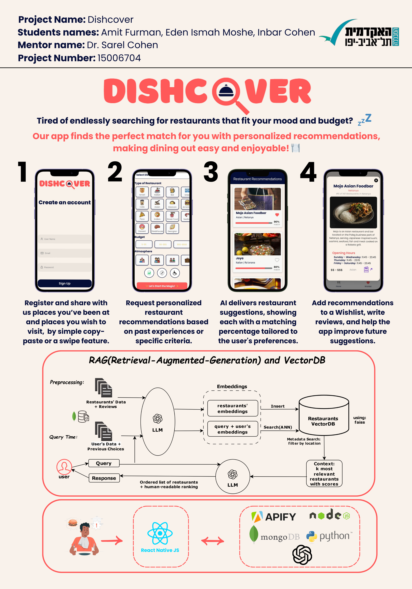

# Dishcover



Dishcover is a personalized restaurant recommendation app that helps users find the perfect dining spots based on their preferences, past experiences, and current mood. The app leverages AI and machine learning to continuously refine recommendations, making dining out easier and more enjoyable.

## Table of Contents

- [Features](#features)
- [Installation](#installation)
- [Usage](#usage)
- [External Dependencies](#external-dependencies)
- [Acknowledgments](#acknowledgments)

## Features

- **Personalized Recommendations:** The app provides a personalized feed of restaurant recommendations tailored to the user's preferences and history.
- **Wishlist Management:** Users can add desired restaurants to a wishlist and manage their dining spots from their profile.
- **Review and Feedback:** After visiting a recommended restaurant, users can leave reviews and ratings to refine future suggestions.
- **AI-Powered Suggestions:** AI delivers restaurant suggestions with a matching percentage that aligns with the user's tastes and preferences.
  
## Installation

### Backend Setup

1. **Clone the repository:**
   ```bash
   git clone https://github.com/yourusername/dishcover.git
   ```

2. **Navigate to the backend directory:**
   ```bash
   cd dishcover/Backend
   ```

3. **Install backend dependencies:**
   ```bash
   npm install
   ```

4. **Set up environment variables:**
   Create a `.env` file in the `backend` directory and add the required environment variables (e.g., database URL, API keys).

5. **Run the backend server:**
   ```bash
   npm start
   ```

   The backend will typically run on `http://localhost:3000` or a port specified in your environment variables.

### Frontend Setup

1. **Navigate to the frontend directory:**
   ```bash
   cd ../Frontend
   ```

2. **Install frontend dependencies:**
   ```bash
   npm install
   ```

3. **Set up environment variables:**
   Create a `.env` file in the `frontend` directory and configure it with the backend server URL and other necessary variables.

4. **Run the frontend application:**
   ```bash
   npm start
   ```

5. **Access the app:**
   Open the app on your mobile device using Expo Go or a simulator/emulator.

## Usage

- **Sign Up:** Create an account by providing basic information and setting up your preferences.
- **Explore Recommendations:** Browse through a personalized feed of restaurant recommendations based on your initial input and ongoing interactions.
- **Add to Wishlist:** Save restaurants you'd like to visit to your wishlist for easy access later.
- **Review Restaurants:** After dining, leave a review to help improve future recommendations.
- **Get Tailored Suggestions:** Utilize AI-driven suggestions for the best restaurant matches based on your mood and past dining experiences.

## External Dependencies

- **Apify API:** The app uses data from the Apify API, which aggregates information from sources like Travel Advisor. This data is essential for generating accurate restaurant recommendations.
- **AI and Machine Learning Services:** The app leverages external AI services for analyzing user preferences and refining recommendations over time.

## Acknowledgments

- **Mentor:** Dr. Sarel Cohen for guiding us through the development process.
- **Team:** Inbar Cohen, Amit Furman, Eden Ismah Moshe.
- **External Tools:** Apify, Travel Advisor, and various AI/ML services that powered the app's functionality.
